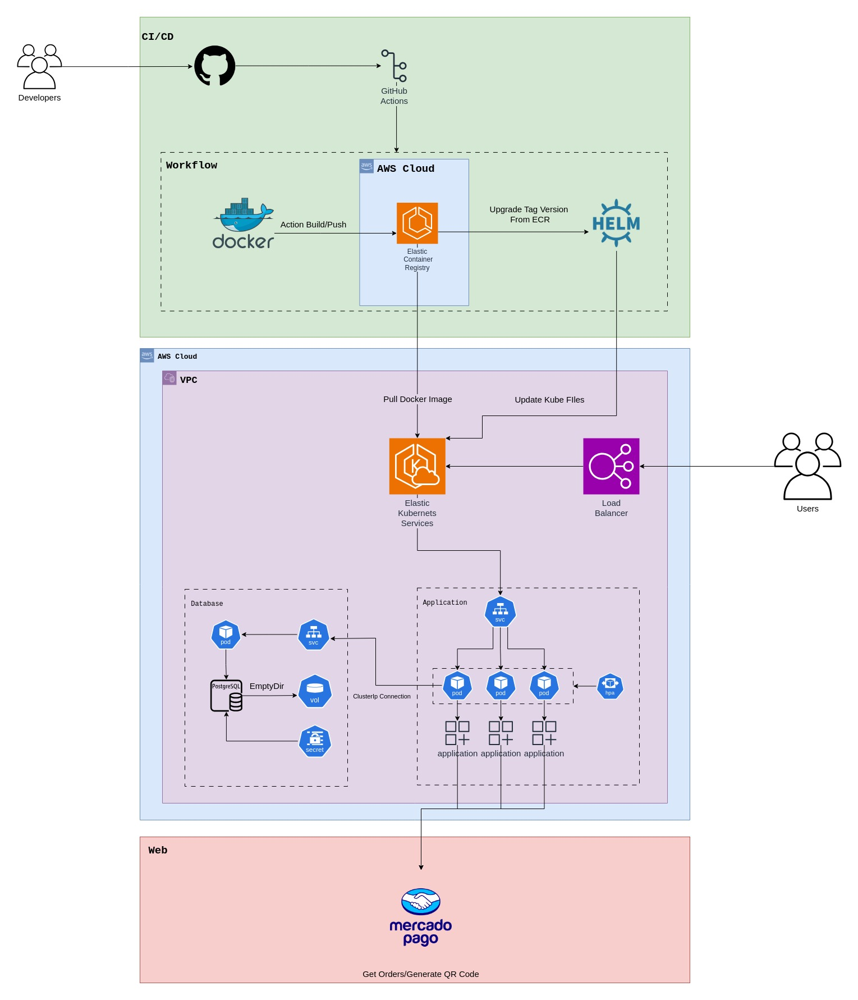

# postech-fiap-lanchonete
# Lanchonete - Versão 2.0.0

Bem-vindo ao projeto **Lanchonete**! Esta é a versão 2.0.0, e abaixo você encontrará todas as instruções necessárias para começar a utilizar Docker e Docker Compose para rodar a aplicação.

## Arquitetura do Projeto:



## Pré-Requisitos

Antes de prosseguir, assegure-se de que você tem o Docker e o Docker Compose instalados em seu sistema. Caso ainda não os tenha instalado, visite a [documentação oficial do Docker](https://docs.docker.com/get-docker/) para obter instruções de instalação.

## Estrutura do Projeto

O projeto tem a seguinte estrutura de diretórios:

```plaintext
lanchonete/
│   docker-compose.yml
│   Dockerfile
│   ...
```


- `Dockerfile`: Arquivo com instruções para a criação da imagem Docker.
- `docker-compose.yml`: Arquivo de configuração para rodar a aplicação com o Docker Compose, definindo serviços, volumes, portas, entre outros.

## Construindo a Imagem Docker

Para construir a imagem Docker do projeto, abra um terminal, vá até a raiz do projeto e execute o seguinte comando:

`docker build -t lanchonete:latest`

## Executando a Imagem Docker com `postgres:13.3`:

`docker-compose up`

# Guia de Execução do Projeto e Utilização das APIs

Antes de iniciar, certifique-se de ter o Docker instalado em sua máquina. A seguir, são apresentados os passos necessários para executar o projeto localmente.

## Passo 1: Inicializando o Ambiente

Abra o terminal na pasta do projeto e execute o seguinte comando:

```bash
docker-compose up
```

Este comando iniciará todas as imagens Docker necessárias para a execução do projeto.

## Passo 2: Cadastro de Usuário

Para efetuar um pedido e o checkout, é necessário cadastrar um usuário. Utilize a seguinte API para isso:

### Cadastrar ou Identificar Usuário

- **Método:** POST
- **URL:** `/lanchonete/api/v1/clientes`

Esta API cadastra um novo usuário na base de dados. Se o usuário já estiver cadastrado, a API o identificará.

## Passo 3: Cadastro de Produtos

Antes de criar um pedido, é necessário cadastrar os produtos disponíveis. Utilize a seguinte API para isso:

### Cadastrar Produtos

- **Método:** POST
- **URL:** `/lanchonete/api/v1/produto`

Esta API permite o cadastro de produtos, essenciais para a criação de um pedido.

## Passo 4: Criação do Pedido

Agora, podemos criar o pedido. Utilize a seguinte API:

### Criar Pedido

- **Método:** POST
- **URL:** `/lanchonete/api/v1/pedidos`

Envie os IDs dos produtos desejados e as credenciais do cliente que está realizando a solicitação. Lembre-se de que o cliente pode optar por fazer o pedido de forma anônima.

## 5. WebHook para Pagamento do Pedido usando Mercado Pago

Utilize o seguinte WebHook para realizar o pagamento do pedido de forma integrada com a API do Mercado Pago. Este processo ocorre da seguinte maneira:

### WebHook para Pagamento

- **Método:** POST
- **URL:** `/lanchonete/api/v1/pedidos/webhook?id=:id`

Este WebHook efetua o pagamento do pedido por meio da integração com a API do Mercado Pago. Após a conclusão bem-sucedida do pagamento, o status de pagamento do pedido é atualizado para "pago".

Atenção: A variável de ambiente MERCADO_PAGO_ENABLED está por padrão False, onde não utiliza diretamente a API do Mercado Pago, para utilização precisa colocar ela como True, além de criar e utilizar as credenciais necessárias do Mercado Pago.

## Passo 6: Realizando o Checkout do Pedido

Após criar o pedido, é hora de realizar o checkout para dar continuidade ao processo. Utilize a seguinte API:

### Realizar Checkout do Pedido

- **Método:** PATCH
- **URL:** `/lanchonete/api/v1/pedidos/:id`

Esta API realiza o checkout do pedido identificado pelo ID fornecido. O pedido deve estar no status "recebido" e já ter sido pago. A API então altera o status do pedido para "em preparação".

Ao completar este passo, seu pedido estará oficialmente em preparação, seguindo o fluxo de processos estabelecido pelo sistema.

## Passo 7: Alterando o Status do Pedido para Pronto

Após o processo de preparação do pedido, é possível alterar o status para "pronto". Siga os passos abaixo:

### Alterar Status do Pedido para Pronto

- **Método:** PATCH
- **URL:** `/lanchonete/api/v1/pedidos/:id/status/PRONTO`

Utilize esta API para atualizar o status do pedido identificado pelo ID fornecido, alterando-o para "pronto". Este passo indica que o pedido está preparado e pronto para ser entregue ou retirado.

Ao realizar esta operação, você conclui o processo de preparação do pedido, garantindo uma gestão eficiente do status no sistema da lanchonete.

# Links do Projeto

Grupo 31:

RM351033: Douglas Andrade Cerqueira da Silva

RM351085: Mateus Mosquera Vaz Pinto

- **Notion**: https://www.notion.so/DDD-Lanchonete-1ee618b71633412bba8d8bc1ee8abb24?pvs=4
- **Miro**: https://miro.com/app/board/uXjVNaJOrLg=/
- **Youtube**: https://youtu.be/nJMPecZI_IQ
- **Swagger**: http://localhost:8080/lanchonete/api/v1/swagger-ui/index.html
- **Postman**: https://www.postman.com/fiap-lanchonete/workspace/lanchonete-fiap/collection/30674104-a326e42c-d972-4a48-9c46-a8417cb0327b?action=share&creator=30674104
